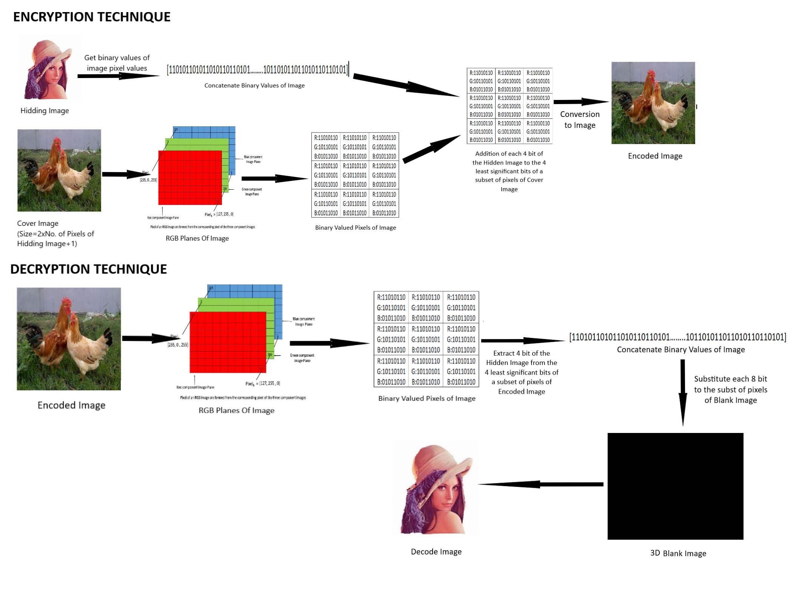

# Image Steganography

Image Steganography is the prcesses of hiding data(like image, words, sentences or any other data formats) in the image called Cover Image. This help the user to share the data with priavcy and security.

This application is build in pyhton using Bit-Plane Slicing technique. 

#### Here is the working of the model:

#### To run the file:
1. Open cmd
2. Change the Directory to ".../Image Steganography/src" (using cmd command cd)
3. In cmd type "pipenv shell"and run
4. In cmd type "pipenv install django==3.1.7" and run
5. In cmd type "pipenv install PILLOW" and run
6. In cmd type "pipenv install Image" and run
7. In cmd type "pipenv install opencv-python" and run
8. In cmd type "python manage.py runserver" and run
9. Copy the url to run the Django framework on browser.
10. You are ready to use the application

The main code for working of application is over ".../Image Steganography/src/firstApp/views.py"
The html script for application is at ".../Image Steganography/src/tempaltes/home.htm"
